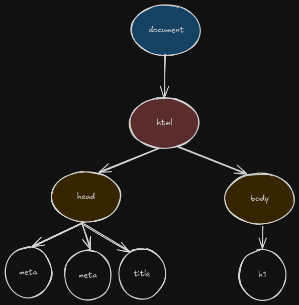
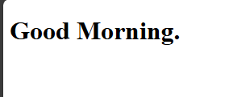
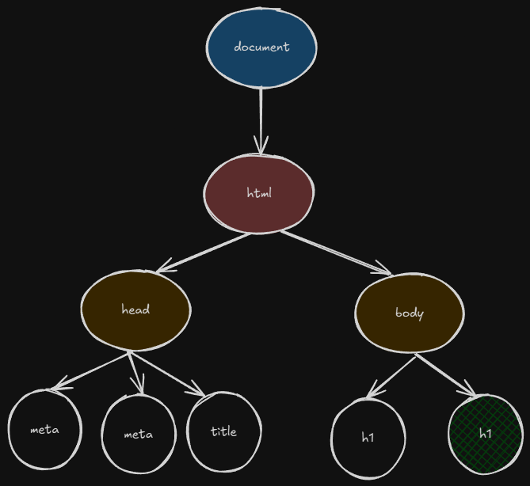
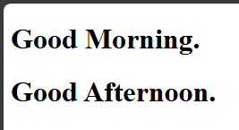
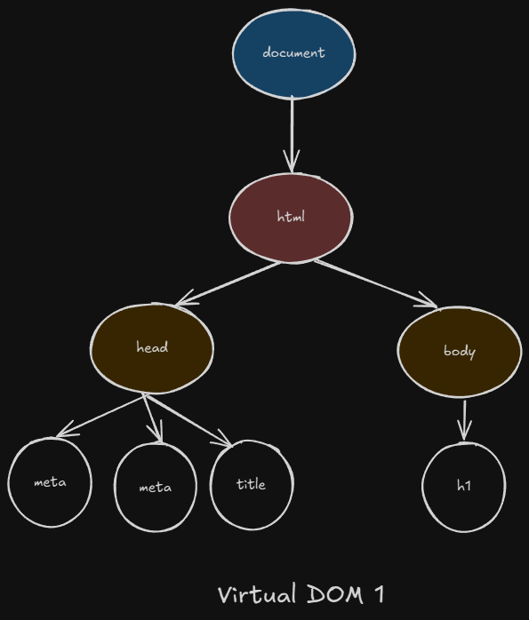
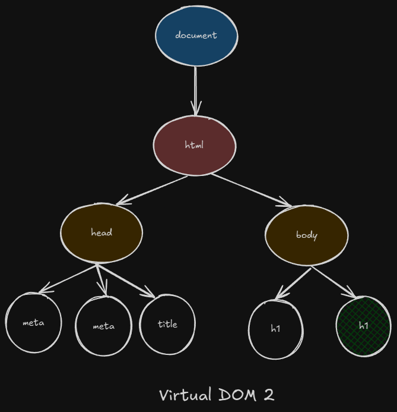
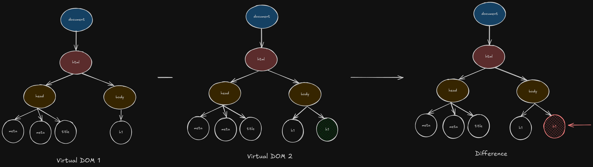
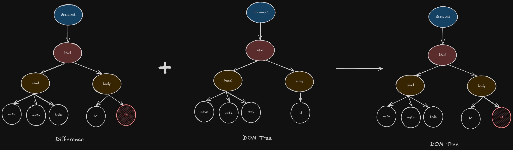

# ReactJS

# What is React?

React (also known as React.js or ReactJS) is a free and open-source front-end JavaScript library for building user interfaces (UIs).

## Why React?

- React's primary purpose is to help us build the "view" layer of web applications. It focuses solely on how the user interface looks and behaves.
- React encourages building UIs using reusable pieces of code called components. Each component manages its own state and renders a specific part of the UI. This modular approach makes complex UIs easier to build and maintain.
- With React, we describe what we want the UI to look like for a given state, rather than giving step-by-step instructions on how to change it (imperative). React then efficiently updates and renders only the necessary components when our data changes. This makes our code more predictable and easier to debug.
- React uses a Virtual DOM to optimize UI updates. It efficiently calculates the minimal changes needed to the actual browser DOM, leading to faster and smoother user experiences.

## Library and Framework

### Library

A library is a collection of reusable code (functions, classes, or modules) designed to perform specific tasks. You, the developer, decide when and how to use these tools in your program. Libraries are modular, meaning you can pick and choose what you need without being forced to follow a specific structure.

**Characteristics**

- Control: We have full control over the flow of your program. You call the library’s functions when needed.
- Scope: Libraries are narrow in focus, addressing specific functionalities like data manipulation, HTTP requests, or UI rendering.
- Flexibility: We can integrate a library into any part of your project and combine it with other libraries or custom code.
- No Structure Imposed: Libraries don’t dictate how your application should be organized.

### Framework

A framework is a pre-defined structure or blueprint for building an application. It provides a skeleton with rules, conventions, and tools that guide how our code is organized and executed.

**Characteristics**

- Control: The framework dictates the flow of the application. We plug our code into its predefined structure (e.g., specific folders, lifecycle methods).
- Scope: Frameworks are broad, providing a full ecosystem for building apps, often including tools for routing, templating, data handling, and more.
- Structure Imposed: Frameworks enforce a specific architecture (e.g., MVC, MVVM) to ensure consistency and scalability.
- Less Flexibility: We must follow the framework’s conventions, which can feel restrictive but streamline development.

## Traditional Way

Suppose we have a html file as

```html
<!DOCTYPE html>
<html lang="en">
  <head>
    <meta charset="UTF-8" />
    <meta name="viewport" content="width=device-width, initial-scale=1.0" />
    <title>Document</title>
  </head>
  <body>
    <h1>Good Morning.</h1>
  </body>
</html>
```

So when this html file is given to our browser, it will convert this document into DOM (Document Object Model), where our each HTML element is represented into tree like structure (nodes).



And based on the DOM tree, the content is displayed in our browser.



Let's suppose we again, add another heading as

```html
<!DOCTYPE html>
<html lang="en">
  <head>
    <meta charset="UTF-8" />
    <meta name="viewport" content="width=device-width, initial-scale=1.0" />
    <title>Document</title>
  </head>
  <body>
    <h1>Good Morning.</h1>
    <h1>Good Afternoon.</h1>
  </body>
</html>
```

And now the browser will add our new node i.e. our `<h1>Good Afternoon.</h1>` and render the **Good Afternoon** right? Not exactly.
So, here is the catch, the browser will reconstruct the dom tree from the beginning, adding our new node for the heading **Good Afternoon** and then it will render the contents on our page from the beginning (repaint).





### Problem

- Every time the HTML content changes (e.g., adding the `<h1>Good Afternoon.</h1>`), the browser parses the entire HTML document again to rebuild the DOM tree from scratch. This is computationally expensive, especially for complex pages with many elements. Even a small change, like adding a single heading, forces the browser to reprocess the entire document, which can slow down rendering.
- After reconstructing the DOM, the browser must recalculate the layout (reflow) and repaint the entire page. This involves determining the position, size, and style of every element, even those unaffected by the change.
- Rebuilding the entire DOM for a minor change (e.g. adding one `<h1>` element) wastes CPU and memory resources. The browser reprocesses unchanged elements, like the existing `<h1>Good Morning.</h1>`, even though they don’t need updating.
- In traditional websites, a full page reload (common when fetching updated HTML) can reset the user’s state, such as scroll position, form inputs, or dynamic UI elements (e.g., an open dropdown).

## React Way

**1. Virtual DOM**

The Virtual DOM (VDOM) is a lightweight, in-memory representation of the actual web browser's DOM. Think of it as a blueprint or a sketch of what the real user interface should look like at any given moment. It's a plain JavaScript object that mirrors the structure of your HTML elements.

Let's take the above example

```html
<!DOCTYPE html>
<html lang="en">
  <head>
    <meta charset="UTF-8" />
    <meta name="viewport" content="width=device-width, initial-scale=1.0" />
    <title>Document</title>
  </head>
  <body>
    <h1>Good Morning.</h1>
  </body>
</html>
```

So when this html file is given to our browser, it will convert this document into DOM (Document Object Model), where our each HTML element is represented into tree like structure (nodes).


And based on the DOM tree, the content is displayed in our browser.


Now, after the first render, the something called a virtual DOM is created which is the replica of our DOM tree.



**2. Diffing Algorithm**

The Diffing Algorithm is a comparison process that React uses to figure out what has changed between two Virtual DOM trees. Whenever your React component's state or props change, React creates a new Virtual DOM tree representing the updated UI. The Diffing Algorithm then compares this new VDOM tree with the previous VDOM tree.

Let's suppose we again, add another heading as

```html
<!DOCTYPE html>
<html lang="en">
  <head>
    <meta charset="UTF-8" />
    <meta name="viewport" content="width=device-width, initial-scale=1.0" />
    <title>Document</title>
  </head>
  <body>
    <h1>Good Morning.</h1>
    <h1>Good Afternoon.</h1>
  </body>
</html>
```

Now comes the interesting part, the browser will not reconstruct the dom tree from the beginning, instead it will create a new virtual DOM with the changes.



Now, our current virtual DOM is compared with the previously created virtual DOM, and changes are figured out. In our case, Virtual DOM 1 is compared with Virtual DOM 2.



**3. Reconciliation**

Reconciliation is the process of applying the changes identified by the Diffing Algorithm to the actual browser DOM. It's the final step where React takes the determined minimal changes and updates the visible user interface.

Now, the change is injected into our original DOM tree, which is then rendered by our browser.


